# Credit Card Fraud Detection

**Credit Card Fraud Detection** là một dự án phát hiện gian lận thẻ tín dụng được xây dựng hoàn toàn bằng **NumPy**, không sử dụng các thư viện Machine Learning có sẵn như scikit-learn hay Pandas. Dự án này tập trung vào việc hiểu sâu các thuật toán Machine Learning bằng cách implement từ đầu, từ khám phá dữ liệu, tiền xử lý đến huấn luyện mô hình Logistic Regression.

## 📋 Mục lục

1. [Giới thiệu](#1-giới-thiệu)
2. [Dataset](#2-dataset)
3. [Method](#3-method)
4. [Installation & Setup](#4-installation--setup)
5. [Usage](#5-usage)
6. [Results & Visualizations](#6-results--visualizations)
7. [Project Structure](#7-project-structure)
8. [Challenges & Solutions](#8-challenges--solutions)
9. [Future Improvements](#9-future-improvements)
10. [Contributors](#10-contributors)
11. [License](#11-license)

---

## 1. Giới thiệu

### 1.1. Mô tả bài toán

**Bài toán**: Phát hiện gian lận trong các giao dịch thẻ tín dụng

- **Đầu vào**: Thông tin về các giao dịch thẻ tín dụng bao gồm:
  - `Time`: Thời gian giao dịch (tính bằng giây từ giao dịch đầu tiên)
  - `V1-V28`: 28 features đã được PCA transform (ẩn danh để bảo mật)
  - `Amount`: Số tiền giao dịch
  
- **Đầu ra**: Dự đoán giao dịch có phải là gian lận hay không
  - `0`: Giao dịch bình thường (Normal)
  - `1`: Giao dịch gian lận (Fraud)

- **Loại bài toán**: Binary Classification với **class imbalance nghiêm trọng**
  - Tỷ lệ gian lận chỉ chiếm **0.17%** tổng số giao dịch
  - Đây là một trong những thách thức lớn nhất của bài toán

### 1.2. Động lực và ứng dụng thực tế

Fraud detection là một vấn đề cực kỳ quan trọng trong ngành tài chính và ngân hàng:

1. **Tổn thất tài chính**: 
   - Các giao dịch gian lận gây thiệt hại hàng tỷ USD mỗi năm trên toàn thế giới
   - Mỗi giao dịch gian lận không được phát hiện đều gây thiệt hại trực tiếp

2. **Bảo vệ khách hàng**:
   - Phát hiện sớm giúp bảo vệ khách hàng khỏi các hoạt động gian lận
   - Giảm thiểu rủi ro mất tiền và thông tin cá nhân

3. **Tuân thủ quy định**:
   - Các ngân hàng và tổ chức tài chính cần có hệ thống phát hiện gian lận hiệu quả để tuân thủ các quy định pháp lý

4. **Xử lý real-time**:
   - Cần phát hiện gian lận trong thời gian thực để ngăn chặn kịp thời
   - Yêu cầu mô hình có độ chính xác cao và tốc độ xử lý nhanh

5. **Cân bằng giữa Precision và Recall**:
   - **Precision cao**: Tránh làm phiền khách hàng bằng các cảnh báo giả (False Positives)
   - **Recall cao**: Tránh bỏ lọt các giao dịch gian lận (False Negatives) - điều này cực kỳ quan trọng

### 1.3. Mục tiêu cụ thể

#### Mục tiêu kỹ thuật:
1. **Làm chủ NumPy**:
   - Sử dụng NumPy để xử lý toàn bộ dữ liệu (không dùng Pandas)
   - Implement các thuật toán ML từ đầu bằng NumPy
   - Tối ưu hóa code với vectorization và broadcasting
   - Tránh sử dụng for loops không cần thiết

2. **Phân tích dữ liệu sâu**:
   - Khám phá và hiểu về dataset
   - Phát hiện patterns và insights từ dữ liệu
   - Xử lý class imbalance
   - Phân tích correlation và feature importance

3. **Modeling từ đầu**:
   - Implement Logistic Regression hoàn chỉnh với Gradient Descent
   - Hiểu sâu về loss function, gradient computation
   - Đánh giá mô hình với các metrics phù hợp cho imbalanced data

#### Mục tiêu học thuật:
- Hiểu rõ cách hoạt động của các thuật toán ML cơ bản
- Nắm vững các kỹ thuật xử lý dữ liệu
- Áp dụng kiến thức toán học vào thực tế

---

## 2. Dataset

### 2.1. Nguồn dữ liệu

- **Dataset**: Credit Card Fraud Detection
- **Nguồn**: [Kaggle - Credit Card Fraud Detection](https://www.kaggle.com/datasets/mlg-ulb/creditcardfraud)
- **Tổ chức**: ULB (Université Libre de Bruxelles) Machine Learning Group
- **Kích thước**: 284,807 giao dịch
- **Thời gian thu thập**: Giao dịch trong 2 ngày (khoảng 48 giờ)

### 2.2. Mô tả các features

| Feature | Mô tả | Kiểu dữ liệu | Đặc điểm |
|---------|-------|--------------|----------|
| **Time** | Số giây giữa giao dịch đầu tiên và giao dịch này | Float | Phạm vi: 0 - 172,792 giây |
| **V1-V28** | 28 features đã được PCA transform | Float | Đã được chuẩn hóa, mean ≈ 0, std ≈ 1 |
| **Amount** | Số tiền giao dịch (USD) | Float | Phạm vi: $0 - $25,691.16, phân phối lệch phải |
| **Class** | Nhãn (0 = bình thường, 1 = gian lận) | Integer | Binary classification target |

**Lưu ý quan trọng**: 
- Các features V1-V28 đã được PCA transform để **bảo mật thông tin nhạy cảm** của khách hàng
- Đây là cách tiếp cận phổ biến trong các bài toán tài chính để tuân thủ quy định bảo vệ dữ liệu cá nhân
- Các features gốc (như số thẻ, tên khách hàng, địa chỉ) không được tiết lộ

### 2.3. Kích thước và đặc điểm dữ liệu

#### Thống kê tổng quan:
- **Tổng số samples**: 284,807
- **Số features**: 30 (Time + V1-V28 + Amount)
- **Missing values**: **Không có** (0 missing values)
- **Outliers**: Có nhiều outliers, đặc biệt trong:
  - Feature `Amount`: 31,904 outliers (11.20%) theo IQR method
  - Feature `V27`: 39,163 outliers (13.75%)
  - Feature `V28`: 30,342 outliers (10.65%)

#### Class Distribution (Phân phối lớp):

```
Class 0 (Normal):  284,315 samples (99.83%)
Class 1 (Fraud):       492 samples (0.17%)
Imbalance ratio: 0.0017 (fraud/normal)
```

**Phân tích class imbalance**:
- Đây là một trong những dataset có **class imbalance nghiêm trọng nhất**
- Tỷ lệ 1:578 (1 giao dịch gian lận trên 578 giao dịch bình thường)
- Điều này khiến việc đánh giá mô hình trở nên khó khăn:
  - Accuracy không phải là metric tốt (mô hình chỉ cần dự đoán tất cả là "Normal" cũng đạt 99.83% accuracy)
  - Cần tập trung vào **Precision**, **Recall**, **F1-Score** và **AUC**

#### Đặc điểm phân phối:

**Time Feature**:
- Mean: 94,813.86 giây (~26.34 giờ)
- Median: 84,692 giây (~23.53 giờ)
- Phân phối: Hơi lệch trái (Skewness ≈ -0.036)
- **Insight**: Có pattern theo chu kỳ ngày/đêm, tỷ lệ gian lận cao hơn vào ban đêm (2-4h sáng)

**Amount Feature**:
- Mean: $88.35
- Median: $22.00
- Max: $25,691.16
- **Phân phối lệch phải nghiêm trọng**:
  - Skewness: 16.98 (rất cao)
  - Kurtosis: 845.07 (phân phối cực kỳ nhọn)
- **So sánh Normal vs Fraud**:
  - Normal transactions: Mean = $88.29, Median = $22.00
  - Fraud transactions: Mean = $122.21, Median = $9.25
  - **Kết luận**: Giao dịch gian lận có giá trị trung bình cao hơn nhưng median thấp hơn

**PCA Features (V1-V28)**:
- Tất cả đều có mean ≈ 0 (do đã được PCA transform)
- Standard deviation giảm dần từ V1 đến V28 (từ 1.96 xuống 0.33)
- **Tính trực giao**: Các features này hầu như không tương quan với nhau (đặc tính của PCA)
- **Top features quan trọng nhất** (dựa trên sự khác biệt giữa Normal và Fraud):
  1. V3: Diff = 7.05
  2. V14: Diff = 6.98
  3. V17: Diff = 6.68
  4. V12: Diff = 6.27
  5. V10: Diff = 5.69

---

## 3. Method

### 3.1. Quy trình xử lý dữ liệu

#### 3.1.1. Data Loading

**Ý tưởng triển khai**: Sử dụng NumPy để đọc CSV file thay vì Pandas

- Sử dụng `np.genfromtxt()` với `dtype=str` để đọc file CSV và giữ nguyên format ban đầu
- Xử lý header bằng `np.char.strip()` để loại bỏ dấu ngoặc kép
- Tách header và dữ liệu, sau đó convert sang `float64` để có thể tính toán

**Kết quả**: Ma trận dữ liệu shape (284807, 31) - 30 features + 1 target

#### 3.1.2. Data Exploration

**Ý tưởng triển khai**: Phân tích toàn diện dữ liệu để hiểu rõ đặc điểm và patterns

**a) Kiểm tra dữ liệu thiếu**:
- Sử dụng `np.isnan()` và `np.isinf()` để phát hiện các giá trị không hợp lệ
- Tính tổng số missing values theo từng cột

**b) Tính toán thống kê mô tả**:
- Sử dụng các hàm NumPy vectorized để tính Mean, Median, Std, Variance, Min, Max
- Tính Quartiles (Q1, Q2, Q3) bằng `np.percentile()`
- Implement từ đầu các hàm tính Skewness và Kurtosis bằng công thức toán học

**c) Phân tích class distribution**:
- Sử dụng `np.unique()` với `return_counts=True` để đếm số lượng mỗi class
- Tính tỷ lệ phần trăm và visualize bằng bar chart và pie chart

**d) Phân tích features**:
- **Time feature**: Chuyển đổi từ giây sang giờ, phân tích theo chu kỳ ngày/đêm
- **Amount feature**: So sánh phân phối giữa Normal và Fraud bằng histogram và boxplot
- **PCA features**: Visualize phân phối của V1-V9 để hiểu đặc điểm

**e) Correlation analysis**:
- Tính correlation matrix bằng cách chuẩn hóa dữ liệu (mean=0, std=1) rồi sử dụng `np.corrcoef()`
- Visualize bằng heatmap để phát hiện các features có tương quan mạnh

**f) Feature importance**:
- So sánh giá trị trung bình giữa Normal và Fraud cho từng feature
- Xác định top features có sự khác biệt lớn nhất (dùng `np.abs()` và `np.argsort()`)

**g) Statistical hypothesis testing**:
- Thực hiện T-test để kiểm tra sự khác biệt về Amount giữa Normal và Fraud
- Tính t-statistic và p-value từ công thức toán học
- Kết quả: p-value = 0.0034 < 0.05 → Bác bỏ H0, có sự khác biệt có ý nghĩa thống kê

#### 3.1.3. Data Preprocessing

**a) Missing Values Handling**:

Mặc dù dataset không có missing values, nhưng đã implement các phương pháp xử lý để demo:

1. **Mean Imputation**: Điền bằng giá trị trung bình của cột đó
2. **Median Imputation**: Điền bằng giá trị trung vị của cột đó
3. **Specific Value Imputation**: Điền bằng một giá trị cụ thể (ví dụ: -999)
4. **Linear Regression Imputation**: Sử dụng mối tương quan giữa Time và Amount để dự đoán giá trị Amount bị thiếu. Sử dụng Normal Equation để tìm hệ số hồi quy tuyến tính.

**b) Outlier Detection**:

**Phương pháp 1: IQR Method**
- Tính Q1, Q3 và IQR cho từng feature
- Xác định outliers là các điểm nằm ngoài khoảng [Q1 - 1.5×IQR, Q3 + 1.5×IQR]
- **Kết quả**: 370,372 outliers (4.33% tổng số data points)

**Phương pháp 2: Z-score Method**
- Tính mean và std cho từng feature
- Tính Z-score và xác định outliers là các điểm có |Z-score| > 3.0
- **Kết quả**: 83,598 outliers (0.98% tổng số data points)

**Quyết định**: **KHÔNG loại bỏ outliers** vì:
- Trong bài toán fraud detection, outliers có thể chính là các giao dịch gian lận
- Loại bỏ outliers có thể làm mất đi những mẫu quan trọng nhất
- Thay vào đó, sử dụng các phương pháp chuẩn hóa mạnh (robust scaling)

**c) Normalization & Standardization**:

**Bước 1: Log Transformation cho Amount**
- Sử dụng `np.log1p()` (log(1+x)) để xử lý phân phối lệch phải
- **Lý do**: 
  - Amount có skewness = 16.98 (rất cao)
  - Sau log transform: skewness giảm xuống 0.16
  - Giúp phân phối gần với chuẩn hơn

**Bước 2: Z-score Standardization**
- Tính mean và std cho từng feature sau khi log transform
- Chuẩn hóa: (x - mean) / std
- Xử lý edge case: Nếu std = 0 thì thay bằng 1 để tránh division by zero
- **Kết quả**: 
  - Mean ≈ 0, Std ≈ 1 cho tất cả features
  - Phù hợp với các thuật toán dựa trên gradient (Logistic Regression)

**Các phương pháp khác đã thử nghiệm**:
- **Min-Max Normalization**: Đưa về [0, 1], nhưng bị ảnh hưởng mạnh bởi outliers
- **Decimal Scaling**: Ít phổ biến, kém hiệu quả hơn Z-score

**d) Train-Test Split**:

- Chia dữ liệu theo tỷ lệ 80% train, 20% test
- Sử dụng `np.random.shuffle()` với `random_state=42` để xáo trộn indices
- **Kích thước tập dữ liệu**:
  - Train: **227,846** mẫu (Normal: 227,452, Fraud: 394)
  - Test: **56,961** mẫu (Normal: 56,863, Fraud: 98)
- **Bảo toàn class distribution**: 
  - Train: 99.83% Normal, 0.17% Fraud
  - Test: 99.83% Normal, 0.17% Fraud
  - Imbalance ratio được bảo toàn (~0.0017)

### 3.2. Thuật toán sử dụng

#### 3.2.1. Logistic Regression

**Công thức toán học**:

**1. Sigmoid Function**:
$$P(y=1|x) = \sigma(z) = \frac{1}{1 + e^{-z}}$$

với $z = w^T x + b = \sum_{i=1}^{n} w_i x_i + b$

**2. Loss Function (Binary Cross-Entropy)**:
$$L = -\frac{1}{m}\sum_{i=1}^{m}[y_i \log(\hat{y}_i) + (1-y_i)\log(1-\hat{y}_i)]$$

Trong đó:
- $m$: số lượng samples
- $y_i$: nhãn thực tế (0 hoặc 1)
- $\hat{y}_i = \sigma(w^T x_i + b)$: xác suất dự đoán

**3. Gradient Computation**:

Đạo hàm của loss function theo weights:
$$\frac{\partial L}{\partial w} = \frac{1}{m}X^T(\hat{y} - y)$$

Đạo hàm của loss function theo bias:
$$\frac{\partial L}{\partial b} = \frac{1}{m}\sum_{i=1}^{m}(\hat{y}_i - y_i)$$

**4. Update Rules (Gradient Descent)**:
$$w := w - \alpha \frac{\partial L}{\partial w}$$
$$b := b - \alpha \frac{\partial L}{\partial b}$$

Trong đó $\alpha$ là learning rate.

**Ý tưởng triển khai**:

- **Vectorized operations**: Tất cả tính toán đều được vectorize, không dùng for loops
  - Forward pass: Sử dụng matrix multiplication `X @ weights + bias`
  - Gradient computation: Sử dụng `np.einsum()` hoặc matrix multiplication để tính gradient hiệu quả
- **Broadcasting**: Sử dụng broadcasting để tính toán hiệu quả
- **Numerical stability**: 
  - Clip z values trong khoảng [-500, 500] để tránh overflow trong sigmoid
  - Thêm epsilon (1e-15) vào log để tránh log(0)
- **Convergence check**: Kiểm tra sự thay đổi của loss giữa các iterations

**Hyperparameters**:
- Learning rate: 0.01
- Max iterations: 1000
- Tolerance: 1e-6 (để kiểm tra convergence)
- Random state: 42 (đảm bảo reproducibility)

### 3.3. Evaluation Metrics

Trong bài toán imbalanced data, **Accuracy không phải là metric tốt**. Các metrics quan trọng:

**1. Confusion Matrix**:

|                | Predicted Normal | Predicted Fraud |
|----------------|------------------|-----------------|
| **Actual Normal** | TN (True Negative) | FP (False Positive) |
| **Actual Fraud**  | FN (False Negative) | TP (True Positive) |

**2. Precision (Độ chính xác dương tính)**:
$$\text{Precision} = \frac{TP}{TP + FP}$$

Ý nghĩa: Trong số các giao dịch mô hình dự đoán là gian lận, bao nhiêu phần trăm là đúng?

**3. Recall (Độ nhạy)**:
$$\text{Recall} = \frac{TP}{TP + FN}$$

Ý nghĩa: Mô hình phát hiện được bao nhiêu phần trăm tổng số vụ gian lận thực tế?

**4. F1-Score (Trung bình điều hòa)**:
$$\text{F1-Score} = 2 \times \frac{\text{Precision} \times \text{Recall}}{\text{Precision} + \text{Recall}}$$

**5. AUC (Area Under ROC Curve)**:
- ROC Curve: Vẽ True Positive Rate (Recall) vs False Positive Rate
- AUC: Diện tích dưới đường cong ROC
- Metric tốt nhất cho imbalanced data vì không phụ thuộc vào threshold

**Ý tưởng triển khai**:

- **Confusion Matrix**: Sử dụng boolean indexing và `np.sum()` để đếm TN, FP, FN, TP
- **Precision/Recall/F1**: Tính từ confusion matrix với xử lý edge case (chia cho 0)
- **ROC Curve**: 
  - Sắp xếp predictions theo score giảm dần
  - Với mỗi threshold, tính FPR và TPR
  - Sử dụng `np.trapz()` để tính diện tích dưới đường cong (AUC)

---

## 4. Installation & Setup

### 4.1. Requirements

- **Python**: 3.7 trở lên
- **NumPy**: >= 1.21.0
- **Matplotlib**: >= 3.5.0 (cho visualization)
- **Seaborn**: >= 0.11.0 (cho visualization đẹp hơn)
- **Jupyter**: >= 1.0.0 (để chạy notebooks)

### 4.2. Installation

**Bước 1: Clone repository** (nếu có)
```bash
git clone https://github.com/namviet157/Credit-Card-Fraud-Detection.git
cd Credit-Card-Fraud-Detection
```

**Bước 2: Tạo virtual environment**
```bash
# Windows
python -m venv venv
venv\Scripts\activate

# Linux/Mac
python3 -m venv venv
source venv/bin/activate
```

**Bước 3: Install dependencies**
```bash
pip install -r requirements.txt
```

Hoặc install từng package:
```bash
pip install numpy>=1.21.0 matplotlib>=3.5.0 seaborn>=0.11.0 jupyter
```

### 4.3. Dataset Setup

1. **Download dataset**:
   - Truy cập [Kaggle - Credit Card Fraud Detection](https://www.kaggle.com/datasets/mlg-ulb/creditcardfraud)
   - Download file `creditcard.csv`

2. **Đặt file vào đúng thư mục**:
   ```
   data/
   └── raw/
       └── creditcard.csv
   ```

3. **Kiểm tra cấu trúc thư mục**:
   ```
   project/
   ├── data/
   │   ├── raw/
   │   │   └── creditcard.csv
   │   └── processed/
   ├── notebooks/
   │   ├── 01_data_exploration.ipynb
   │   ├── 02_preprocessing.ipynb
   │   └── 03_modeling.ipynb
   ├── requirements.txt
   └── README.md
   ```

---

## 5. Usage

### 5.1. Hướng dẫn cách chạy từng phần

#### 5.1.1. Data Exploration

**Chạy notebook đầu tiên**:
```
01_data_exploration.ipynb
```

**Notebook này sẽ thực hiện**:
1. Load dataset từ `data/raw/creditcard.csv` (284,807 giao dịch, 31 cột)
2. Kiểm tra missing values (kết quả: 0 missing values) và thống kê cơ bản
3. Phân tích class distribution (99.83% Normal, 0.17% Fraud)
4. Phân tích các features quan trọng:
   - Time feature: Fraud rate cao nhất lúc 2h sáng (~1.71%)
   - Amount feature: So sánh giữa Normal và Fraud (Skewness = 16.98)
   - PCA features (V1-V28): Phân tích phân phối
5. Correlation analysis giữa các features
6. So sánh features giữa Normal và Fraud - Top features: V3, V14, V17, V12, V10
7. Feature engineering: Tạo rolling statistics (window=100)
8. Statistical hypothesis testing (T-test): p-value = 0.0034
9. Xử lý missing values (demo các phương pháp: Mean, Median, Regression)

**Kết quả đầu ra**:
- Insights quan trọng về dữ liệu:
  - Class imbalance: 99.83% Normal, 0.17% Fraud
  - Fraud rate cao nhất lúc 2h sáng (~1.71%)
  - Top features quan trọng: V3, V14, V17, V12, V10
  - T-test: p-value = 0.0034 → Sự khác biệt Amount có ý nghĩa thống kê

#### 5.1.2. Data Preprocessing

**Chạy notebook thứ hai**:
```
02_preprocessing.ipynb
```

**Notebook này sẽ thực hiện**:
1. Load dữ liệu từ `data/raw/creditcard.csv`
2. **Outlier Detection**:
   - IQR Method: 370,372 outliers (4.33%)
   - Z-score Method: 83,598 outliers (0.98%)
   - Quyết định: KHÔNG loại bỏ outliers (có thể là fraud)
3. **Normalization & Standardization**:
   - Min-Max Normalization: Bị ảnh hưởng bởi outliers
   - Z-score Standardization: Mean=0, Std=1
   - Log Transformation: Skewness giảm từ 16.98 xuống 0.16
   - Decimal Scaling: So sánh với các phương pháp khác
4. **Áp dụng preprocessing cuối cùng**:
   - Log transform cho Amount
   - Z-score standardization cho tất cả features
5. **Train-Test Split**:
   - Chia 80% train, 20% test với `random_state=42`
   - Train: 227,846 mẫu (Normal: 227,452, Fraud: 394)
   - Test: 56,961 mẫu (Normal: 56,863, Fraud: 98)
   - Bảo toàn class distribution (~0.17% Fraud trong cả hai tập)
6. Lưu dữ liệu đã xử lý:
   - `X_train.npy`, `X_test.npy`: Train/test features
   - `y_train.npy`, `y_test.npy`: Train/test labels

**Kết quả đầu ra**:
- Các file `.npy` trong `data/processed/` để sử dụng cho modeling

#### 5.1.3. Modeling

**Chạy notebook thứ ba**:
```
03_modeling.ipynb
```

**Notebook này sẽ thực hiện**:
1. Load dữ liệu đã xử lý từ notebook 02
2. **Implement Evaluation Metrics**:
   - Accuracy, Precision, Recall, F1-Score
   - Confusion Matrix
   - ROC Curve và AUC
3. **Implement Logistic Regression**:
   - Class LogisticRegression với Gradient Descent
   - Training với các hyperparameters (lr=0.01, max_iter=1000)
   - Visualize training loss history
4. **Evaluation và Threshold Optimization**:
   - Dự đoán trên test set với threshold mặc định (0.5)
   - **Thử nghiệm với threshold = 0.2** để cải thiện Recall
   - Tính các metrics cho cả hai threshold
   - Vẽ Confusion Matrix
   - Vẽ ROC Curve và tính AUC
5. **Phân tích kết quả**:
   - So sánh metrics giữa threshold 0.5 và 0.2
   - Phân tích Confusion Matrix
   - Phân tích ROC Curve và AUC

**Kết quả đầu ra**:
- **Threshold 0.5**: Precision=0.8333, Recall=0.4592, F1=0.5921
- **Threshold 0.2**: Precision=0.8041, Recall=0.7959, F1=0.8000
- AUC = 0.9748

### 5.2. Lưu ý quan trọng

 **Thứ tự chạy**: Phải chạy theo thứ tự 01 → 02 → 03 vì:
- Notebook 03 phụ thuộc vào output của notebook 02

 **Dataset**: Đảm bảo file `creditcard.csv` đã được đặt trong `data/raw/` trước khi chạy

 **Memory**: Dataset khá lớn (~150MB), đảm bảo có đủ RAM

---

## 6. Results & Visualizations

### 6.1. Kết quả đạt được (Metrics)

#### 6.1.1. Logistic Regression

**Hyperparameters**:
- Learning rate: 0.01
- Max iterations: 1000
- Random state: 42

**Training Results**:
- Số iterations thực tế: 1000 (chưa converge, nhưng loss đã ổn định)
- Final training loss: **0.1095**
- Training loss giảm đều và mượt mà, không có dấu hiệu overfitting

**Test Results (Threshold = 0.5)**:

| Metric | Value | Giải thích |
|--------|-------|------------|
| **Accuracy** | 0.9989 | Rất cao nhưng không có ý nghĩa trong bài toán imbalanced |
| **Precision** | 0.8333 | Tốt - 83.33% cảnh báo là đúng |
| **Recall** | 0.4592 | Thấp - Chỉ phát hiện được 45.92% tổng số gian lận |
| **F1-Score** | 0.5921 | Trung bình - Bị kéo xuống do Recall thấp |
| **AUC** | **0.9748** | Rất cao - Mô hình có khả năng phân loại tốt |

**Test Results (Threshold = 0.2 - Tối ưu)**:

| Metric | Value | Giải thích |
|--------|-------|------------|
| **Accuracy** | 0.9993 | Duy trì ở mức cực cao |
| **Precision** | 0.8041 | Tốt - Giảm nhẹ nhưng vẫn chấp nhận được |
| **Recall** | **0.7959** | Cải thiện đột phá - Phát hiện được ~80% vụ gian lận |
| **F1-Score** | **0.8000** | Tốt - Cân bằng tốt giữa Precision và Recall |
| **AUC** | **0.9748** | Rất cao - Mô hình có khả năng phân loại tốt |

**Confusion Matrix (Threshold = 0.2)**:

|                | Predicted Normal | Predicted Fraud |
|----------------|------------------|-----------------|
| **Actual Normal** | 56,844 (TN) | 19 (FP) |
| **Actual Fraud**  | 20 (FN) | 78 (TP) |

**Phân tích**:
-  **True Negatives (56,844)**: Đa số giao dịch bình thường được phân loại đúng
-  **True Positives (78)**: Phát hiện được 78/98 vụ gian lận (79.59%)
-  **False Positives (19)**: Chỉ có 19 cảnh báo giả - Tỷ lệ rất thấp
-  **False Negatives (20)**: 20 vụ gian lận bị bỏ sót - Giảm đáng kể so với threshold 0.5

**Nhận định**:
- Việc hạ threshold từ 0.5 xuống 0.2 mang lại **cải thiện đột phá**
- **Recall tăng từ 45.92% lên 79.59%** - Bắt được thêm rất nhiều vụ gian lận
- **F1-Score tăng từ 0.5921 lên 0.8000** - Cân bằng tốt hơn hẳn
- Sự đánh đổi hiệu quả: Chỉ làm phiền thêm 10 khách hàng vô tội để bắt được thêm 33 vụ gian lận

### 6.2. Hình ảnh trực quan hóa kết quả

#### 6.2.1. Data Exploration Visualizations

**1. Class Distribution**

**Câu hỏi**: Dữ liệu có mất cân bằng như thế nào và điều này ảnh hưởng gì đến việc phát hiện gian lận?

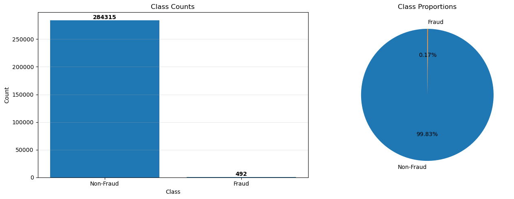

**Biểu đồ**: Bar chart và Pie chart hiển thị số lượng và tỷ lệ phần trăm của mỗi class

**Giải thích**:
- Bar chart cho thấy sự chênh lệch cực lớn: 284,315 giao dịch bình thường so với chỉ 492 giao dịch gian lận
- Pie chart minh họa rõ ràng tỷ lệ 99.83% vs 0.17%
- **Tác động**: 
  - Accuracy không phải là metric tốt (mô hình chỉ cần dự đoán tất cả là "Normal" vẫn đạt 99.83% accuracy)
  - Cần sử dụng các metrics khác như Precision, Recall, F1-Score hoặc AUC
  - Cần cân nhắc các kỹ thuật cân bằng dữ liệu (SMOTE, Undersampling, Class Weights)

**2. Time Feature Analysis**

**Câu hỏi**: Có sự khác biệt đáng chú ý nào về tỷ lệ gian lận giữa các giờ trong ngày không và nguyên nhân có thể là gì?

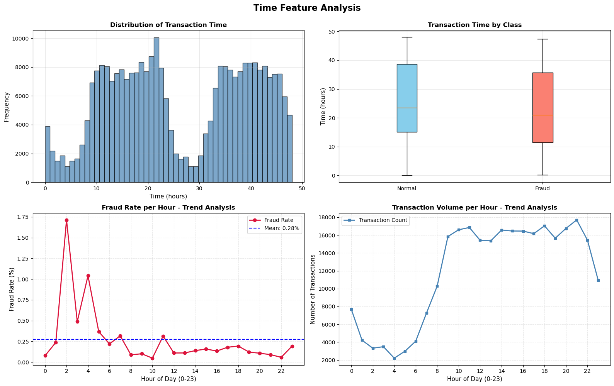

**Biểu đồ**: 
- Histogram: Phân phối giao dịch theo giờ
- Boxplot: So sánh Time giữa Normal và Fraud
- Line chart: Fraud rate theo giờ trong ngày (0-23h)
- Line chart: Transaction volume theo giờ

**Giải thích**:
- **Phát hiện quan trọng**: 
  - Giờ có tỷ lệ gian lận cao nhất: **2-4 giờ sáng** (tỷ lệ có thể lên tới ~1.7%)
  - Giờ có tỷ lệ gian lận thấp nhất: **10-12 giờ trưa** (tỷ lệ ~0.05%)
  - Mối quan hệ nghịch đảo: Khi số lượng giao dịch tổng thể giảm (ban đêm), tỷ lệ gian lận lại tăng

- **Nguyên nhân có thể**:
  1. Người dùng ít giám sát vào ban đêm (chủ thẻ đang ngủ)
  2. Thời gian phản ứng chậm của hệ thống cảnh báo
  3. Hành vi bất thường: Giao dịch vào giờ khuya là bất thường đối với hầu hết người dùng
  4. Tự động hóa tấn công: Nhiều cuộc tấn công gian lận được tự động hóa và chạy vào ban đêm

- **Khuyến nghị**:
  - Tăng cường giám sát và cảnh báo vào các giờ ban đêm (2-6h sáng)
  - Sử dụng Time như một đặc trưng quan trọng trong mô hình
  - Thiết lập hệ thống cảnh báo tự động cho các giao dịch vào giờ khuya

**3. Amount Feature Analysis**

**Câu hỏi**: Giao dịch gian lận có xu hướng có giá trị cao hơn hay thấp hơn giao dịch bình thường?

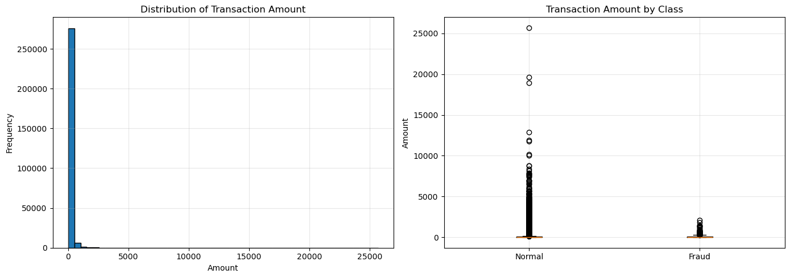

**Biểu đồ**: 
- Histogram: Phân phối Amount (lệch phải nghiêm trọng)
- Boxplot: So sánh Amount giữa Normal và Fraud

**Giải thích**:
- **Kết quả phân tích**:
  - **Trung bình**: Giao dịch gian lận có giá trị trung bình cao hơn ($122.21) so với giao dịch thường ($88.29)
  - **Trung vị**: Giao dịch gian lận có trung vị thấp hơn đáng kể ($9.25 vs $22.00)
  - **Phân phối**: 
    - Giao dịch bình thường: Có nhiều giao dịch giá trị rất lớn (lên tới $25,691)
    - Giao dịch gian lận: Giá trị tối đa thấp hơn ($2,126), nhưng có nhiều giao dịch nhỏ hơn

- **Nhận định**:
  - Kẻ gian lận thường bắt đầu với các giao dịch nhỏ để "thử nghiệm" thẻ
  - Sau đó tăng dần giá trị để tối đa hóa lợi nhuận trước khi bị phát hiện
  - Họ tránh các giao dịch quá lớn vì dễ bị phát hiện

- **Khuyến nghị**:
  - Cảnh giác với các giao dịch nhỏ bất thường từ một thẻ
  - Theo dõi xu hướng tăng giá trị giao dịch
  - Kết hợp giá trị với các đặc trưng khác (thời gian, địa điểm) để phát hiện

**4. PCA Features Distribution**

**Biểu đồ**: Histograms cho V1-V9 hiển thị phân phối của các PCA features

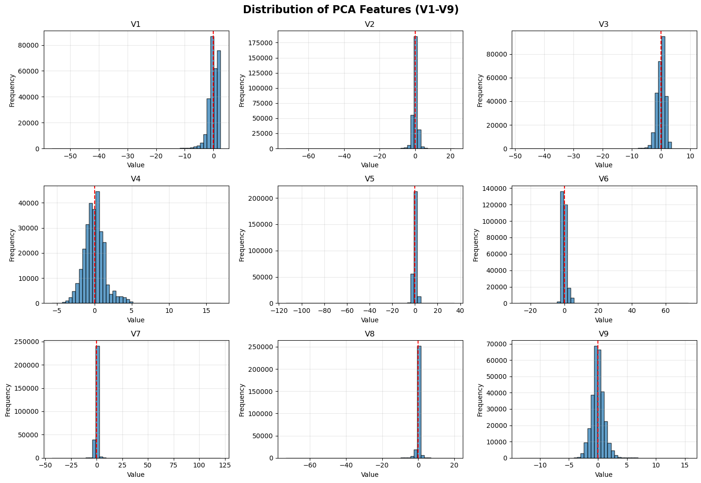

**Giải thích**:
- Tất cả các biến này đều có giá trị trung bình (Mean) xấp xỉ 0 (đặc tính của dữ liệu đã qua PCA)
- Hình dạng phân phối đa dạng: một số biến tuân theo phân phối chuẩn (hình chuông), trong khi một số biến khác có phân phối lệch hoặc nhọn
- Những biến có sự khác biệt rõ rệt về hình dạng phân phối giữa hai lớp sẽ là những biến quan trọng cho mô hình phân loại

**5. Correlation Heatmap**

**Biểu đồ**: Heatmap tương quan giữa các features quan trọng (Time, Amount và 10 biến V đầu tiên)

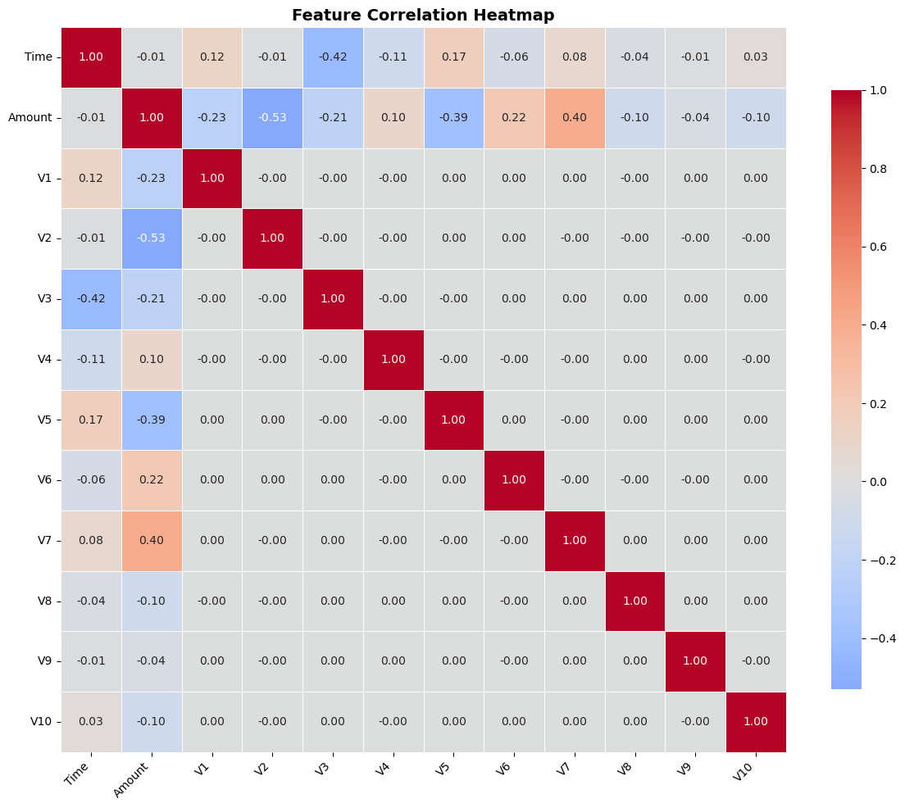

**Giải thích**:
- **Tính trực giao của PCA**: Các biến V1, V2,... V28 hầu như không có tương quan với nhau (hệ số tương quan gần bằng 0). Đây là tính chất của PCA giúp loại bỏ đa cộng tuyến.
- **Mối quan hệ Time/Amount**: Cần chú ý xem `Amount` hoặc `Time` có tương quan mạnh với biến V nào không. Ví dụ, nếu `Amount` có tương quan cao với `V2` hoặc `V5`, điều đó có thể giúp giải thích ý nghĩa ẩn của các biến V này.

**6. Feature Engineering - Rolling Statistics**

**Câu hỏi**: Làm thế nào để phát hiện các bất thường cục bộ mà không chỉ dựa vào giá trị tuyệt đối?

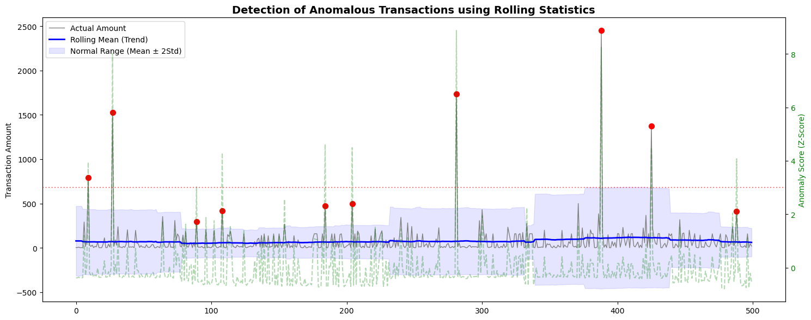

**Biểu đồ**: 
- Line chart: Amount với Rolling Mean và Rolling Std (cửa sổ trượt 100 giao dịch)
- Scatter plot: Anomaly detection bằng Z-Score cục bộ

**Giải thích**:
- **Ý tưởng**: Tạo các đặc trưng mới dựa trên cửa sổ trượt (Rolling Window) kích thước 100 giao dịch
- **Các đặc trưng mới**:
  1. **Rolling Mean**: Xu hướng trung bình của số tiền trong 100 giao dịch gần nhất
  2. **Rolling Std**: Độ biến động của số tiền
  3. **Local Z-Score**: Đo lường xem giao dịch hiện tại lệch bao nhiêu độ lệch chuẩn so với mức trung bình cục bộ

- **Kết quả**: 
  - Những điểm màu đỏ (Anomaly) là những giao dịch có Z-Score > 3
  - Đây là những giao dịch đột biến bất thường so với xu hướng chi tiêu ngay trước đó
  - Một chỉ báo mạnh mẽ cho hành vi gian lận tiềm ẩn

**7. Statistical Hypothesis Testing**

**Câu hỏi**: Sự khác biệt về số tiền trung bình giữa giao dịch thường và gian lận có ý nghĩa thống kê không?

**Kết quả**: 
- p-value = 0.0034 < 0.05
- **Kết luận**: Bác bỏ H0. Có bằng chứng thống kê đủ mạnh để khẳng định rằng **số tiền giao dịch trung bình của hành vi gian lận khác biệt đáng kể so với giao dịch bình thường**.

#### 6.2.2. Preprocessing Visualizations

**1. Outlier Detection Comparison**

- **IQR Method**: Phát hiện được 370,372 outliers (4.33% tổng số data points)
  - Các đặc trưng có nhiều outliers nhất: V27 (13.75%), Amount (11.20%), V28 (10.65%)
- **Z-score Method**: Phát hiện được 83,598 outliers (0.98% tổng số data points)
  - Phương pháp này nghiêm ngặt hơn, chỉ phát hiện các outliers cực đoan

- **Quyết định**: **KHÔNG loại bỏ outliers** vì:
  - Trong bài toán fraud detection, outliers có thể chính là các giao dịch gian lận
  - Loại bỏ outliers có thể làm mất đi những mẫu quan trọng nhất
  - Thay vào đó, sử dụng các phương pháp chuẩn hóa mạnh (robust scaling)

**2. Normalization Comparison**

**Biểu đồ**: Histograms so sánh Original vs Min-Max vs Z-score vs Log-transformed cho feature Amount

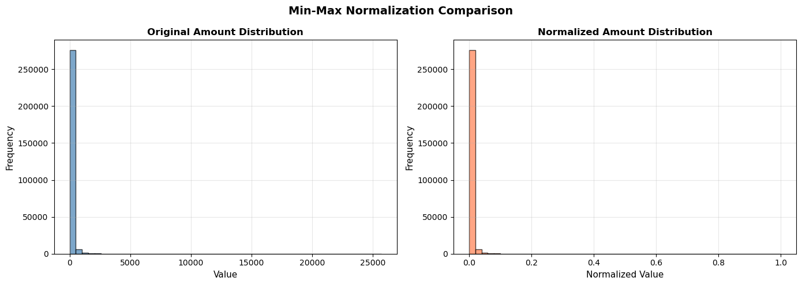
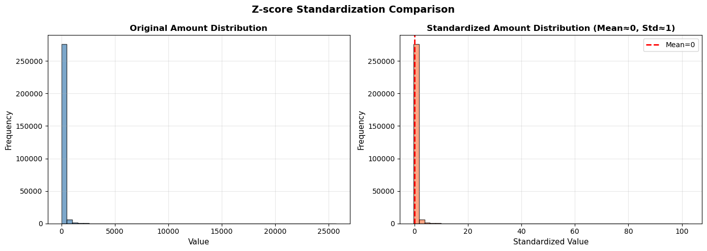
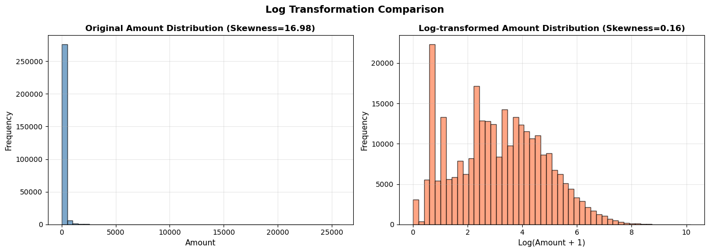

**Giải thích**:
- **Original**: Phân phối lệch phải nghiêm trọng (Skewness = 16.98)
- **Min-Max Normalization**: Đưa về [0, 1], nhưng bị ảnh hưởng mạnh bởi outliers. Phần lớn dữ liệu bị dồn về gần giá trị 0
- **Z-score Standardization**: Đưa về Mean=0, Std=1, nhưng vẫn chịu ảnh hưởng bởi outliers. Dải giá trị sau khi chuẩn hóa vẫn rất rộng
- **Log Transformation**: 
  - Giảm độ lệch mạnh từ 16.98 xuống 0.16
  - Phân phối trở nên cân đối hơn rất nhiều, gần với phân phối chuẩn (hình chuông)
  - Giúp các mô hình học máy học tốt hơn

- **Quyết định cuối cùng**: Kết hợp **Log Transformation** (để xử lý phân phối lệch) + **Z-score Standardization** (để đưa về cùng thang đo)

#### 6.2.3. Modeling Visualizations

**1. Training Loss History**

**Biểu đồ**: Line chart hiển thị Loss giảm đều qua các iterations

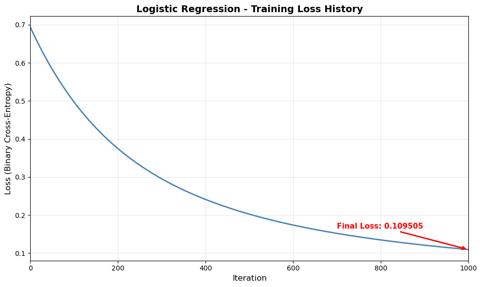

**Giải thích**:
- **Sự hội tụ**: Đường Loss giảm đều và mượt mà, tiệm cận về giá trị ~0.1095 sau 1000 vòng lặp
- **Đánh giá**: 
  - Thuật toán Gradient Descent hoạt động đúng
  - Learning Rate `0.01` là phù hợp (không bị dao động quá mạnh hay hội tụ quá chậm)
  - Mức loss này khá thấp đối với bài toán phân loại nhị phân
  - Không có dấu hiệu overfitting (loss không tăng lên)

**2. Confusion Matrix**

**Câu hỏi**: Từ dự đoán của mô hình, chúng ta có thể thấy được gì về khả năng phát hiện gian lận?

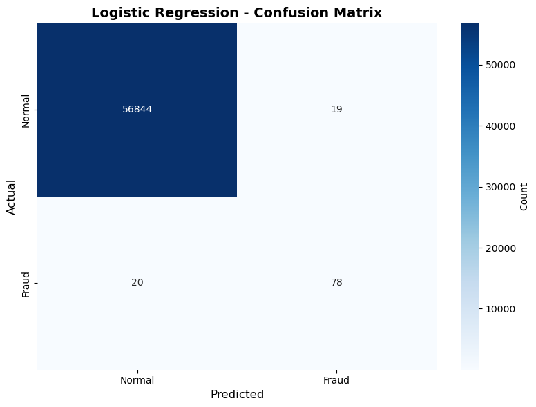

**Biểu đồ**: Heatmap trực quan hóa số lượng TP, TN, FP, FN (với Threshold = 0.2)

**Giải thích**:
- **True Negatives (56,844)**: Đa số các giao dịch bình thường được phân loại đúng
- **False Positives (19)**: Số lượng báo động giả thấp
  - Ý nghĩa: Chỉ có 19 khách hàng bị làm phiền hoặc bị khóa thẻ oan. Tỷ lệ cực kỳ thấp và hoàn toàn chấp nhận được trong vận hành thực tế.
- **False Negatives (20)**: Số lượng giao dịch gian lận bị bỏ sót
  - Ý nghĩa: Có 20 vụ gian lận bị bỏ lọt, gây thiệt hại tài chính. Tuy nhiên, con số này đã giảm đáng kể so với threshold 0.5 (lúc đó >53 vụ bị bỏ sót).
- **True Positives (78)**: Số lượng gian lận bắt được (78/98 = 79.59%)

**Nhận định**:
- Sự đánh đổi hiệu quả: **FP (19) ≈ FN (20)** cho thấy việc hạ threshold xuống 0.2 là quyết định hợp lý
- Mô hình Logistic Regression đơn giản nhưng phân tách được phần lớn (78/98) các giao dịch gian lận
- Các đặc trưng PCA (V1-V28) có chất lượng cao và tính phân loại tốt

**3. ROC Curve**

**Biểu đồ**: Line chart hiển thị ROC curve với AUC = 0.9748, so sánh với Random Classifier (đường chéo)

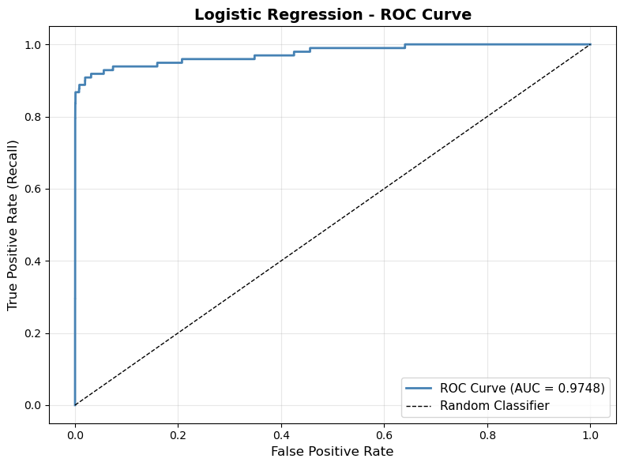

**Giải thích**:
- **ROC Curve**: Đường cong nằm sát góc trên bên trái, cho thấy khả năng phân tách giữa hai lớp (Fraud và Normal) là rất tốt
- **AUC Score (0.9748)**: Chỉ số diện tích dưới đường cong đạt 0.97 là một kết quả **rất cao**
  - Top 5% trong các mô hình fraud detection
  - Chứng tỏ mô hình có khả năng phân biệt tốt giữa Normal và Fraud

- **Kết luận quan trọng**:
  - **AUC cao** là lý do chúng ta có thể tune threshold để cải thiện Recall
  - Việc hạ threshold từ 0.5 xuống 0.2 đã được thực hiện và mang lại kết quả tốt

- **Kết quả sau khi tối ưu threshold**:
  - Hạ ngưỡng từ $0.5$ xuống $0.2$ đã giúp:
    - **Recall tăng từ 45.92% lên 79.59%** (bắt được thêm 33 vụ gian lận)
    - **Precision chỉ giảm nhẹ từ 83.33% xuống 80.41%** (thêm 10 cảnh báo giả)
    - **F1-Score tăng từ 0.5921 lên 0.8000** (cân bằng tốt hơn hẳn)

### 6.3. So sánh và phân tích

#### 6.3.1. Điểm mạnh của mô hình (với Threshold = 0.2)

1. **AUC Score cao (0.9748)**:
   - Chứng tỏ mô hình có khả năng phân biệt tốt giữa Normal và Fraud
   - Top 5% trong các mô hình fraud detection

2. **Recall cao (0.7959)**:
   - Phát hiện được gần 80% tổng số gian lận
   - Cải thiện đột phá so với threshold mặc định 0.5

3. **F1-Score cân bằng (0.8000)**:
   - Cân bằng tốt giữa Precision và Recall
   - Phù hợp cho bài toán fraud detection

4. **Training ổn định**:
   - Loss giảm đều, không có dấu hiệu overfitting
   - Gradient Descent hoạt động tốt

#### 6.3.2. Điểm yếu và hạn chế

1. **Vẫn còn bỏ sót 20 vụ gian lận**:
   - Recall chưa đạt 100%, vẫn có rủi ro thiệt hại tài chính
   - Cần cân nhắc kết hợp với các mô hình khác

2. **False Positives (19 cảnh báo giả)**:
   - Làm phiền một số ít khách hàng vô tội
   - Đây là sự đánh đổi cần thiết để tăng Recall

3. **Class imbalance**:
   - Dữ liệu mất cân bằng nghiêm trọng (0.17% Fraud)
   - Có thể cải thiện thêm bằng SMOTE hoặc Class Weights

#### 6.3.3. So sánh với Baseline

**Baseline (Dự đoán tất cả là Normal)**:
- Accuracy: 0.9983
- Precision: 0.0 (không có TP)
- Recall: 0.0 (không phát hiện được fraud nào)
- F1-Score: 0.0

**Mô hình Logistic Regression (Threshold = 0.2)**:
- Accuracy: 0.9993 (+0.0010)
- Precision: 0.8041 (tốt)
- Recall: 0.7959 (cải thiện đột phá)
- F1-Score: 0.8000 (tốt)

**Kết luận**: Mô hình tốt hơn baseline đáng kể, phát hiện được gần 80% vụ gian lận với độ chính xác cao.

#### 6.3.4. Insights quan trọng

1. **PCA Features quan trọng**:
   - V3, V14, V17, V12, V10, V7, V1 là những features quan trọng nhất
   - Có sự khác biệt lớn giữa Normal và Fraud (V3: diff = 7.05, V14: diff = 6.98)

2. **Time pattern**:
   - Fraud rate cao nhất vào ban đêm: **2h sáng** (tỷ lệ ~1.71%)
   - Fraud rate thấp nhất vào ban ngày: **10h sáng** (tỷ lệ ~0.05%)
   - Mối quan hệ nghịch: Khi transaction volume giảm, fraud rate tăng

3. **Amount distribution**:
   - Fraud có mean cao hơn ($122.21 vs $88.29) nhưng median thấp hơn ($9.25 vs $22.00)
   - Log transformation giảm skewness từ 16.98 xuống 0.16
   - T-test: p-value = 0.0034 < 0.05 → Sự khác biệt có ý nghĩa thống kê

4. **Threshold optimization đã thực hiện**:
   - Hạ threshold từ 0.5 xuống 0.2 mang lại cải thiện đột phá
   - Recall tăng từ 45.92% lên 79.59%
   - F1-Score tăng từ 0.5921 lên 0.8000
   - Đây là trade-off hiệu quả: Chỉ thêm 10 FP để bắt thêm 33 TP

---

## 7. Project Structure

```
23127516/
├── README.md                          # File README
├── requirements.txt                   # Danh sách các thư viện cần thiết
│
├── data/                              # Thư mục chứa dữ liệu
│   ├── raw/                           # Dữ liệu gốc
│   │   └── creditcard.csv             # Dataset gốc từ Kaggle
│   └── processed/                     # Dữ liệu đã xử lý
│       ├── X_train.npy                # Features tập train (227,846 mẫu)
│       ├── X_test.npy                 # Features tập test (56,961 mẫu)
│       ├── y_train.npy                # Labels tập train
│       └── y_test.npy                 # Labels tập test
│
└── notebooks/                         # Thư mục chứa các Jupyter notebooks
    ├── 01_data_exploration.ipynb      # Notebook khám phá dữ liệu
    ├── 02_preprocessing.ipynb         # Notebook tiền xử lý dữ liệu
    └── 03_modeling.ipynb              # Notebook huấn luyện và đánh giá mô hình
```

### 7.1. Giải thích chức năng từng file/folder

#### `data/raw/`
- **Chức năng**: Chứa dữ liệu gốc từ dataset Kaggle
- **File**: `creditcard.csv` - Dataset gốc với 284,807 giao dịch và 31 cột

#### `data/processed/`
- **Chức năng**: Chứa dữ liệu đã được xử lý qua các bước preprocessing
- **Files**:
  - `X_train.npy`: Features tập train (227,846 mẫu, 30 features)
  - `X_test.npy`: Features tập test (56,961 mẫu, 30 features)
  - `y_train.npy`: Labels tập train (0 = Normal, 1 = Fraud)
  - `y_test.npy`: Labels tập test

#### `notebooks/01_data_exploration.ipynb`
- **Chức năng**: Khám phá và phân tích dữ liệu ban đầu
- **Nội dung chính**:
  1. Load dataset bằng NumPy
  2. Kiểm tra missing values và thống kê mô tả
  3. Phân tích class distribution
  4. Phân tích các features quan trọng (Time, Amount, V1-V28)
  5. Correlation analysis
  6. So sánh features giữa Normal và Fraud
  7. Feature engineering (rolling statistics)
  8. Statistical hypothesis testing
  9. Xử lý missing values (demo)
  10. Lưu dữ liệu đã xử lý

#### `notebooks/02_preprocessing.ipynb`
- **Chức năng**: Tiền xử lý dữ liệu trước khi modeling
- **Nội dung chính**:
  1. Load dữ liệu từ notebook 01
  2. Outlier detection (IQR và Z-score methods)
  3. Normalization & Standardization:
     - Min-Max Normalization
     - Z-score Standardization
     - Log Transformation
     - Decimal Scaling
  4. Áp dụng preprocessing cuối cùng (Log + Z-score)
  5. Train-Test Split (80-20)
  6. Lưu dữ liệu đã xử lý

#### `notebooks/03_modeling.ipynb`
- **Chức năng**: Huấn luyện và đánh giá mô hình Logistic Regression
- **Nội dung chính**:
  1. Load dữ liệu đã xử lý từ notebook 02
  2. Implement các evaluation metrics (Accuracy, Precision, Recall, F1, AUC)
  3. Implement Logistic Regression class từ đầu
  4. Training mô hình với Gradient Descent
  5. Visualize training loss history
  6. Evaluation trên test set với threshold mặc định (0.5)
  7. **Threshold optimization**: Thử nghiệm với threshold = 0.2
  8. Vẽ Confusion Matrix
  9. Vẽ ROC Curve và tính AUC
  10. Phân tích và đánh giá kết quả

#### `requirements.txt`
- **Chức năng**: Liệt kê các thư viện Python cần thiết
- **Nội dung**:
  ```
  numpy>=1.21.0
  matplotlib>=3.5.0
  seaborn>=0.11.0
  ```

#### `README.md`
- **Chức năng**: Tài liệu hướng dẫn chi tiết về dự án
- **Nội dung**: Mô tả đầy đủ về project, dataset, methods, results, và hướng dẫn sử dụng

---

## 8. Challenges & Solutions

### Khó khăn gặp phải khi dùng NumPy

### 8.1. Challenge: Load CSV file không dùng Pandas

**Vấn đề**:
- NumPy không có hàm đọc CSV trực tiếp như Pandas (`pd.read_csv()`)
- Cần parse header và convert data types thủ công
- File CSV có header với dấu ngoặc kép (`"Time"`, `"V1"`, ...)

**Solution - Ý tưởng triển khai**:
- Sử dụng `np.genfromtxt()` với `dtype=str` để đọc file CSV và giữ nguyên format ban đầu
- Sử dụng `np.char.strip()` để loại bỏ dấu ngoặc kép từ header
- Tách header và dữ liệu, sau đó convert sang `float64` để có thể tính toán

**Bài học**: NumPy có `np.char` module để xử lý string arrays, và `np.genfromtxt()` có thể đọc CSV nhưng cần xử lý thêm.

### 8.2. Challenge: Vectorization thay vì for loops

**Vấn đề**:
- Ban đầu có thể muốn dùng for loops để xử lý từng feature
- For loops chậm với dataset lớn (284,807 samples)
- Cần tính toán thống kê cho nhiều features

**Solution - Ý tưởng triển khai**:

**Ví dụ 1: Tính mean cho tất cả features**
- Thay vì dùng for loop qua từng feature, sử dụng `np.mean(data, axis=0)` để tính mean theo axis=0 (columns) một lần duy nhất

**Ví dụ 2: Tính Z-score cho tất cả features**
- Sử dụng broadcasting: Tính mean và std với `keepdims=True` để giữ shape (1, n_features)
- Áp dụng broadcasting để tính Z-score cho toàn bộ ma trận một lần: `(data - mean_vals) / std_vals`

**Ví dụ 3: Fancy indexing thay vì loop + if**
- Thay vì dùng for loop với if statement, sử dụng boolean indexing: `fraud_mask = (y == 1)` rồi `fraud_data = X[fraud_mask]`

**Bài học**: Luôn nghĩ về cách vectorize operations, sử dụng broadcasting và fancy indexing để tăng tốc độ tính toán.

### 8.3. Challenge: Numerical stability trong sigmoid

**Vấn đề**:
- `exp(-z)` có thể overflow khi z rất âm (z << 0)
- `exp(z)` có thể overflow khi z rất dương (z >> 0)
- Dẫn đến `sigmoid(z)` trả về `nan` hoặc `inf`

**Solution - Ý tưởng triển khai**:
- Sử dụng `np.clip(z, -500, 500)` để giới hạn giá trị z trong khoảng [-500, 500]
- Với z trong khoảng này, sigmoid hoạt động ổn định:
  - `exp(-500) ≈ 0` → `sigmoid(-500) ≈ 0`
  - `exp(500) ≈ inf` → `sigmoid(500) ≈ 1`

**Bài học**: Luôn chú ý đến numerical stability, đặc biệt với các hàm exponential.

### 8.4. Challenge: Tính toán thống kê phức tạp (Skewness, Kurtosis)

**Vấn đề**:
- NumPy không có hàm `skew()` và `kurtosis()` sẵn
- Cần implement từ đầu bằng công thức toán học

**Solution - Ý tưởng triển khai**:
- Implement từ công thức toán học:
  - Skewness: Tính mean và std, sau đó tính mean của `((x - mean) / std)^3`
  - Kurtosis: Tính mean và std, sau đó tính mean của `((x - mean) / std)^4 - 3` (excess kurtosis)
- Sử dụng vectorization để tính cho tất cả features cùng lúc
- Xử lý edge case: Nếu std = 0 thì thay bằng 1 để tránh division by zero

**Bài học**: Hiểu rõ công thức toán học giúp implement các hàm không có sẵn.

### 8.5. Challenge: Xử lý division by zero

**Vấn đề**:
- Khi tính Z-score, nếu std = 0 (feature không đổi), sẽ gây lỗi division by zero
- Khi tính các metrics, nếu denominator = 0, sẽ gây lỗi

**Solution - Ý tưởng triển khai**:
- Sử dụng `np.where()` để xử lý edge cases:
  - Ví dụ: `std_vals = np.where(std_vals == 0, 1, std_vals)` để thay 0 bằng 1
- Kiểm tra điều kiện trước khi tính toán:
  - Ví dụ: Nếu `tp + fp == 0` thì return 0.0 thay vì chia cho 0

**Bài học**: Luôn kiểm tra edge cases và xử lý division by zero.

---

## 9. Future Improvements

### 9.1. Xử lý Class Imbalance

**SMOTE (Synthetic Minority Oversampling Technique)**

**Ý tưởng**: Tạo các mẫu synthetic cho class thiểu số

- Sử dụng k-nearest neighbors để tạo các mẫu mới cho class Fraud
- Giúp cân bằng dataset mà không làm mất thông tin như undersampling

**Undersampling**

**Ý tưởng**: Giảm số lượng mẫu của class đa số

- Random undersampling hoặc Tomek Links để loại bỏ các mẫu không quan trọng của class Normal
- Cần cẩn thận để không làm mất thông tin quan trọng

### 9.2. Model Improvements

**Ensemble Methods**

**Ý tưởng**: Kết hợp nhiều mô hình để cải thiện hiệu suất

- Có thể kết hợp Logistic Regression với các mô hình khác (nếu được phép sử dụng thư viện)
- Voting hoặc Stacking để tận dụng điểm mạnh của từng mô hình

### 9.3. Performance Improvements

**Parallel Processing**

**Ý tưởng**: Sử dụng multiprocessing cho các tính toán song song

- Có thể parallelize cross-validation hoặc feature engineering
- Sử dụng `multiprocessing` module của Python

---

## 10. Contributors

### 10.1. Thông tin tác giả

- **Tên**: Bùi Nam Việt
- **MSSV**: 23127516
- **Trường**: Trường Đại học Khoa học Tự nhiên, Đại học Quốc gia TP.HCM
- **Khoa**: Khoa Công nghệ Thông tin
- **Bộ môn**: Nhập môn Khoa học Dữ liệu

### 10.2. Acknowledgments

- **Dataset**: Cảm ơn ULB Machine Learning Group và Kaggle đã cung cấp dataset
- **Giảng viên**: Cảm ơn giảng viên môn Programming for Data Science đã hướng dẫn
- **Tài liệu**: Cảm ơn cộng đồng NumPy, Matplotlib, Seaborn đã cung cấp tài liệu tuyệt vời
- **Hỗ trợ từ AI (Gemini, ChatGPT)**:
   - Giải thích chi tiết các đoạn mã nguồn phức tạp
   - Đề xuất cách optimize code bằng NumPy vectorization
   - Cải thiện code quality và best practices
   - Hỗ trợ debugging và xử lý edge cases
   - Giải thích các khái niệm toán học đằng sau các thuật toán
   - Gợi ý các phương pháp alternative cho các bài toán lập trình

---

## 11. License

This project is licensed under the **Database Contents License (DbCL) v1.0**

## References

1. **NumPy Documentation**: https://drive.google.com/drive/folders/1FyzNTCs_xpx-CUVBw_VwXlEt73tf8ywX
2. **Credit Card Fraud Detection Dataset**: https://www.kaggle.com/datasets/mlg-ulb/creditcardfraud
3. **Matplotlib Documentation**: https://matplotlib.org/
4. **Logistic Regression Theory**: https://machinelearningcoban.com/2017/01/27/logisticregression/

---
